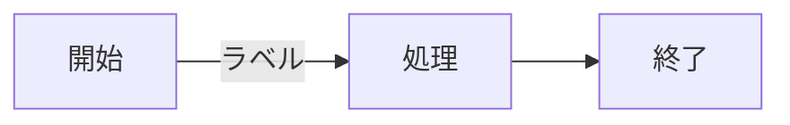

# TakumaTechBlog

## 起動方法

```bash
cd /Users/takumatoiyama/ComputerScience/my-astro-project/TakumaTechBlog
npm run dev
npm run dev -- --host
```

ブラウザで `http://localhost:4321` を開く。

---

## 記事の書き方

### ファイルの場所
`src/content/blog/記事名.md`

### フロントマター（ファイル冒頭に必須）

```yaml
---
title: "日本語タイトル"
title_en: "English Title"
pubDate: 2026-05-22T10:00
description: "記事の説明（省略可）"
tags: ["Dev log"]
url: "article-slug"
---
```

`title_en` を省略した場合、英語モードでも日本語の値が表示される。  
`pubDate` は時刻まで入れると同日複数記事の並び順が正しくなる。

### 本文（日英切り替えあり）

H1 + HTMLコメントを言語マーカーとして使う：

```markdown
# <!--en-->

English summary goes here.
**Bold** and other Markdown work fine.

# <!--ja-->

日本語の詳しい本文をここに書く。
**太字**などのMarkdown記法も使える。
```

**仕組み：**
- `# <!--en-->` と `# <!--ja-->` をマーカーにして、それ以降のコンテンツが次のマーカーまで `<section lang="x">` で囲まれる（remarkプラグイン `src/remark/lang-sections.mjs` で変換）
- Obsidianプレビューではコメントが透明なので「空のH1」として表示される。それでも見出し扱いなので折りたたみ・Outlineが機能する
- 直後に空行を入れるのは推奨（普通のMarkdownと同じ）

### 画像の挿入

```markdown

```

サイズを指定したい場合：
```html

```

- 画像ファイルは `public/images/` に置く
- 英日共通の画像は `<section>` タグの**外**に置く
- Obsidianの添付ファイル保存先を `public/images` に設定すると自動で正しい場所に保存される

### 図の挿入（Mermaid）

` ```mermaid ` のコードブロックを書くだけで図になる（`astro-mermaid` がブラウザ側で描画）。

````markdown

````

**ルール・注意点：**
- **改行は `\n` でなく `<br/>` を使う**。`\n` は文字列のまま表示されることがある  
  例）`A["1行目<br/>2行目"]`
- ノードのテキストは `"..."` で囲む（記号 `&`・空白・日本語を含む場合は必須）
- フローチャート以外も使える: `sequenceDiagram` / `classDiagram` / `gantt` / `pie` など（[公式](https://mermaid.js.org/)）
- ローカル確認は `npm run dev`。古いJSがキャッシュされるので `Cmd + Shift + R` で強制リロード

**仕組み・設定（変更不要、参考）：**
- `astro.config.mjs` の `integrations` に `mermaid({ ... })` を登録
- `mermaidConfig.fontFamily` をサイトと同じ `"JetBrains Mono"` に指定 → 文字幅の計測と描画が一致し、ラベルの箱が見切れない
- `global.css` の `.mermaid` でリガチャ無効化（記号の変形防止）
- コピーボタン（`Layout.astro`）は `article pre:not(.mermaid)` で図を除外（`Copy` 混入によるパースエラー防止）

---

## デザイン変更の方法

`src/styles/global.css` の上部にある `:root` の変数を変えるだけで全体のデザインが変わる。

```css
:root {
  --color-bg:      #ffffff;   /* 背景色 */
  --color-accent:  #2563eb;   /* リンク・アクセントカラー */
  --font-en:       "JetBrains Mono", "Noto Sans JP", sans-serif; /* 英語本文 */
  --font-ja:       "JetBrains Mono", "Noto Sans JP", sans-serif; /* 日本語本文 */
  --max-width:     720px;     /* コンテンツ幅 */
}
```

フォントスタックは左から順に優先。JetBrains Monoに日本語グリフがないため、日本語文字は自動的にNoto Sans JPで表示される。

## Favicon の変更方法

`public/favicon.svg` を差し替えるだけ。SVGはベクター形式なので拡大縮小しても劣化しない。

絵文字を使う最も簡単な方法：
```svg
<svg xmlns="http://www.w3.org/2000/svg" viewBox="0 0 100 100">
  <text y=".9em" font-size="90">🖥️</text>
</svg>
```

既製アイコンは heroicons.com や lucide.dev で入手可能。ブラウザキャッシュが残る場合は `Cmd + Shift + R` で強制リロード。

---

## デプロイ

- ホスティング: **Cloudflare Pages**
- リポジトリ: `TakumaToiyama/TakumaTechBlog`（GitHub）
- `main` ブランチへ push すると自動デプロイ
- ビルドコマンド: `npm run build` / 出力: `dist`

---

# Q&A

## 2026/05/22 - 開発サーバーの起動方法
質問：実際の画面はどうやって確認できますか？  
回答：`npm run dev` を実行してブラウザで `http://localhost:4321` を開く。Claude Codeから実行する場合はプロンプトに `! npm run dev` と入力する。

## 2026/05/22 - 画像・記事のファイル構成
質問：画像と記事のファイルツリー構造を教えて  
回答：記事は `src/content/blog/` に `.md` で置く。画像は `public/images/` に置いて `/images/ファイル名` で参照。

## 2026/05/22 - ObsidianをCMSとして使う構成
質問：記事をObsidianで書きたい。画像の扱いは？  
回答：Vaultは `TakumaTechBlog/` 全体に設定。Obsidian設定で「Wikiリンク → OFF」「添付ファイル保存先 → `public/images`」「新規ノート保存先 → `src/content/blog`」にする。

## 2026/05/22 - 記事作成時にフロントマターを自動挿入したい
質問：タグや公開日などの基本情報を新しく記事を書くたびに自動で追加してほしい。  
回答：ObsidianのコミュニティプラグインTemplaterを使う。「Trigger Templater on new file creation → ON」「Folder Templates で `src/content/blog` にテンプレートを指定」すると自動挿入される。テンプレートは `templates/blog-post.md`。

## 2026/05/22 - ObsidianとVS Code、どちらで書くべきか
質問：Obsidianで書く方法自体は問題ない？  
回答：Obsidianは問題ない。VS Codeは設定ゼロでシンプル。Obsidianは書くことに特化した快適なエディタだが最初に設定が必要。書く頻度が低ければVS Code、頻繁に書くならObsidianが向いている。

## 2026/05/22 - Obsidianの必要な設定
質問：Obsidianの設定ってどんなことが必要なの？  
回答：2つだけ。①「設定 → ファイルとリンク → Wikiリンクを使用」をOFF。②「新規添付ファイルの保存先」を `public/images` に指定。

## 2026/05/22 - 画像の挿入とサイズ調整
質問：写真の挿入とサイズ調整のやり方がわからない  
回答：画像は `public/images/` に置いて `` で挿入。サイズ指定したい場合は `` を使う。英日共通画像は `<section>` タグの外に置く。

## 2026/05/22 - デプロイ先と移行の自由度
質問：Cloudflare Pagesから別のホスティングや自分のサーバーに移せる？  
回答：できる。Astroは静的ファイル（`dist/`）を生成するだけなので、どこに置いても動く。Vercel・Netlifyはリポジトリを繋ぎ直すだけ。自分のサーバーは `dist/` をNginx等で配信するだけ。

## 2026/05/22 - Cloudflare PagesのGit連携が切れた
質問：pushしても自動デプロイされない。「Gitアカウントから切断されています」と表示される。  
回答：Settings → Builds → Git Repository →「Manage」から GitHub を再認証する。再接続後は手動で「Trigger deploy」を一度押して最新化する。

## 2026/05/22 - CloudflareがPRを自動生成した
質問：Cloudflareから自動でPRが来たがこれは何？  
回答：Cloudflare Pagesが自動生成した設定ファイル追加のPR。今のブログには不要なのでGitHub上でそのままクローズして良い。

## 2026/05/22 - デザインを後から変えやすくしたい
質問：後からどうとでもなるようにデザインを整えてほしい  
回答：`src/styles/global.css` にCSS変数（`:root { --color-bg, --color-accent, --font-en ... }`）を集約。デザイン変更は変数の値を書き換えるだけで全体に反映される。

## 2026/05/23 - SVGとは何か
質問：SVGってどういう形式？複数サイズが合わさっているやつ？  
回答：それは `.ico` 形式。SVGはベクター画像形式で、ピクセルでなく数式で図形を描くためどんなサイズでも劣化しない。

## 2026/05/23 - SVGの作り方
質問：SVGってどうやって作るの？  
回答：①絵文字をそのままSVGコードに埋め込む（最簡単）②Figmaでデザインしてエクスポート③heroicons.comやlucide.devで既製アイコンを取得。

## 2026/05/23 - 英語・日本語で別フォントにしたい
質問：英語と日本語のフォントを別々にできるか？  
回答：CSSフォントスタックで可能。`--font-en` と `--font-ja` を別々に定義し、`html.ja body` で切り替え。JetBrains Monoのように日本語グリフがないフォントは自動的に次のフォントにフォールバックするので、`"JetBrains Mono", "Noto Sans JP"` と並べれば英数字はJetBrains Mono・日本語はNoto Sans JPになる。

## 2026/05/23 - 記事内のリンクにアイコンやプレビューを表示したい
質問：記事内に貼ったURLをNotionのようにプレビュー表示したり、Qiitaのアイコンを出せるか？  
回答：標準Markdownだけでは不可。アイコンだけなら `` をMarkdown内に直接書ける。OGPカード（タイトル・説明付きプレビュー）はMDXへの移行とカスタムコンポーネントの実装が必要。

## 2026/05/25 - フォントをセルフホストすると軽くなるか
質問：フォントの情報をフォルダの中に入れておいたら軽くなる？  
回答：軽くなる。現在は Google Fonts から読み込んでいるため、外部サーバーへの DNS 解決と TLS 握手が 2 回発生する（fonts.googleapis.com と fonts.gstatic.com）。セルフホストすると Cloudflare Pages の CDN から同じ接続で配信できるので、初回訪問時に約 100-200ms 速くなる。プライバシー面でも Google にトラフィックが渡らない利点がある。ついでに使うウェイトの絞り込み・Latin サブセット化・`font-display: swap` を指定すると更に軽くなる。

## 2026/05/25 - スマホで毎回デプロイせずに確認する方法
質問：スマホ画面で確認したいが、毎回デプロイしてから確認するのは手間。  
回答：`npm run dev -- --host` でローカルサーバーを LAN に公開。Astro が 3 つの URL を表示する。`localhost:4321` は Mac 内のみ、`192.168.x.x:4321` は同じ WiFi のデバイス、`100.x.x.x:4321` は Tailscale ネットワーク。Tailscale 経由なら別 WiFi や外出先からもアクセス可能。ブラウザの DevTools レスポンシブモード（Chrome は `Cmd+Option+M`）でも事前確認可能。実機での細かいデバッグは USB 接続 + Safari Web Inspector。

## 2026/05/25 - フッターの RSS と © 表記の意味
質問：下にある RSS と © 2026 Takuma Toiyama って何？  
回答：RSS は読者が「購読」できる仕組み。`/rss.xml` を RSS リーダーアプリ（Feedly等）に登録すると新着記事が通知される。© は著作権表示で「このサイトのコンテンツは私のもの」というサイン。書かなくても著作権は自動発生するので法的効力は実質ない。両方とも消しても問題なし。

## 2026/05/24 - JetBrains Monoで日本語は表示されるか
質問：JetBrains Monoに日本語グリフはないと言っていたが、実際には表示されている  
回答：実際に表示できていたため、フォントをJetBrains Monoに一本化。`--font-en`/`--font-ja` の区別をなくし `--font-body: "JetBrains Mono", sans-serif` に統一した。

## 2026/05/29 - Git の CRLF/LF 改行コード警告の意味
質問：`warning: in the working copy of '.obsidian/themes/Minimal/...', CRLF will be replaced by LF` ってどういう意味？  
回答：改行コードの違いの警告で実害なし。CRLF=Windows形式（`\r\n`）、LF=Mac/Linux形式（`\n`）。Minimalテーマのファイルが CRLF を使っているため Git が次回 LF に変換すると知らせている。放置でOK。気になるならテーマは自分で編集しないので `.gitignore` に `.obsidian/themes/` を追加して管理外にするのが一番すっきりする。

---

# 変更ログ

## 2026/06/01 — Go_CSV_Read_Error 英語版の校正（日本語と意味を一致）
スペルミス・ニュアンス差のチェックを依頼。文法のみのミス（意味は通じる）は指示によりそのまま。
- 英語の解説2か所を修正。問題セクション: "more or fewer rows/lines" → 「各行のセル数(cells)の違い」基準に（実際のエラー原因はフィールド数の不一致で、日本語版「セル数」が正しく英語だけ rows にズレていた）。解決法セクション: "number of rows varies" → "each row has a different number of cells" に統一、バッククォート前後のスペース欠けも補完
- スペル `FildPerRecord`→`FieldsPerRecord`、語の誤り `formula`→`file` はユーザーが先に修正済み
- 日本語・コード・文法のみのミスは未変更

## 2026/06/01 11:08 — コピーボタンが横スクロールで一緒に動く問題を修正
コードブロックが横に長く狭い画面でスクロールすると、右上の Copy ボタンも中身と一緒に動いてしまう不具合。原因はボタンが `overflow-x:auto` でスクロールする `pre` の子要素だったため。
- `src/layouts/Layout.astro`: コピーボタン生成時、`pre` をスクロールしないラッパー `<div class="codeblock">` で包み、ボタンを `pre` の子ではなく**ラッパー側**に `appendChild`。位置基準がスクロールしない要素になりボタンが右上固定に（`.codeblock` クラスは CSS 側に元々あったが JS が使っていなかった）
- `src/styles/global.css`: `.codeblock` を位置基準(`position:relative`)＋余白担当に整理。`article pre` から `position:relative` を外し `overflow-x:auto` でスクロール担当。`.codeblock > pre { margin:0 }` で余白の二重がけを防止。ラッパー無しの mermaid 図用に `article pre` の `margin-bottom` は維持
- ビルド成功（29ページ）。実スクロール挙動は要ブラウザ確認（狭い画面＋長い行）

## 2026/06/01 11:00 — 設計見直し：古いページ削除
設計の問題点レビューを依頼され、検出した中から「古いページの本番公開」を修正。
- `src/pages/blog/index-old.astro`（12/15 の遺物）を削除。`/blog/index-old` として本番公開されていた重複一覧ページで、`<Layout>` を必須の `title` 無しで呼んでおり `<title>` が空だった。ビルドは 30→29 ページに減り、当該 URL が消えたことを確認
- 未対応の指摘（任意）: ②`<html lang="en">` が日本語表示時も固定（a11y/SEO）③記事の `og:type=website`・canonical/og:image 無し ④`[...slug].astro` の `getElementById(...)!` 非null断言。日英両本文を1HTMLに入れCSSで隠す方式は gzip後4〜6KB と軽く、追加リクエスト0で速度方針に合致するため現状維持

## 2026/06/01 10:12 — コードブロックの色分け＋行番号対応（Obsidian風に）
Go_CSV_Read_Error 記事のコードブロックが、Obsidian では色分け・行番号付きなのにブログでは無装飾、との指摘。原因は2つ：① ` ```Go `（大文字）が Shiki に認識されず `plaintext` 扱いで色分けなし、② テーマが `github-dark`（暗背景用の明色）なのに CSS で背景を薄グレーに上書きし溶けて見えた。配色はライト（github-light）を希望（`mockups/codeblock-theme.html` で A/B 比較し A を選択）。

- `astro.config.mjs`: `markdown.shikiConfig` を追加。`theme: 'github-light'`、`langAlias: { Go: 'go', Golang: 'go' }`（Obsidian の大文字表記を Shiki の小文字言語名に対応付け、記事側は無修正で OK）
- `src/styles/global.css`: ① `article pre.astro-code { background: var(--color-code-bg) !important }` で Shiki のインライン背景色を上書き ② Shiki が各行に付ける `<span class="line">` に CSS カウンター（`.line::before` の `counter(line)`）で行番号を採番。`user-select: none` で番号は選択・コピー対象外、`::before` なので textContent にも含まれずコピーに混ざらない ③ 横余白を `pre` から `.line` 側へ移動（番号と本文の左余白を揃える）
- 検証: ビルド成功（30ページ）。`data-language="Go"` が `github-light` で色分け（キーワード赤 #D73A49・関数 紫 #6F42C1・型 青 #005CC5・文字列 濃紺 #032F62）、`.line` 65 行（空行も含むので採番連番）

## 2026/05/29 — ankitangoVar1 のタイポ修正
- `## Teck Stach` → `## Tech Stack`（見出しのスペルミス）
- `adds the generated cards to Anki and list Anki deck` → `... and lists Anki decks`（動詞の三単現・複数形）

## 2026/05/29 — ankitangoVar1 の日本語版を執筆
- `src/content/blog/ankitangoVar1.md`: `# <!--ja-->` セクションを、現在の英語版と同じ構成の日本語本文に差し替え（概要 → デモ → アーキテクチャ図 → 技術スタック → 参考 → README誘導）。コードブロックはコマンドなのでそのまま、Mermaid 図は日本語ラベル版を使用。英語版が README 誘導型に作り直されていたため、それに合わせた

## 2026/05/29 — ページネーションに「最初/最後のページ」ボタン追加
- `src/pages/blog/[...page].astro`: 左端に `« First`、右端に `Last »` を追加。`page.url.first` / `page.url.last`（該当ページにいる時は `undefined`）でリンク/無効スパンを出し分け。並びは `« First ← Prev N/M Next → Last »`

## 2026/05/29 — ブログ一覧のページネーション位置を固定
ページごとに「← Prev 1/3 Next →」の縦位置がズレる（記事件数の少ない最終ページで上にズレる）問題を修正。

- `src/pages/blog/[...page].astro`: 記事が `page.size`（5件）に満たないページに、空のプレースホルダ `<li class="placeholder">` を不足分だけ追加。実際の行と同じ `.post-link > .post-title + .post-meta`（中身は `&nbsp;`）構造にして高さを一致させる。全ページが必ず5行になり高さが揃う
- `src/styles/global.css`: `ul.post-list li.placeholder` を罫線なしに。同じクラス構造を再利用するのでデスクトップ/モバイル両対応
- 確認: `/blog`=5件, `/blog/2`=5件, `/blog/3`=1件+プレースホルダ4 で計5行
- 追加修正: ページ1の長いタイトルが2行に折り返して高さがズレていたため、`.post-title` に `white-space: nowrap; overflow: hidden; text-overflow: ellipsis;` を追加し全タイトルを1行＋… 省略に統一
- さらに追加修正: 3ページ目が数px上にズレる残課題。原因はプレースホルダを `border-bottom: none` にしていたため、実記事の行が持つ罫線1px×4本分の高さが不足していた（実ページ4px / 空ページ1px）。`.placeholder` を `border-bottom-color: transparent`（1px幅は維持・透明）に変更し、罫線分の高さも含めて全ページきっかり一致させた
- まだ微ズレ（2→3ページ）: 実記事の `.post-meta` にはタグの pill（枠線+余白）があり、プレーンな `&nbsp;` のプレースホルダより数px高かった。プレースホルダの meta にも `<span class="tag">&nbsp;</span>` を入れ、`ul.post-list li.placeholder .tag { border-color: transparent; color: transparent; }` で透明化。pill の box-model をそのまま再利用するので高さがピクセル一致（全記事に tags 有・空配列なしを確認済み）

## 2026/05/29 — Mermaid 図のサポート追加
ankitangoVar1 記事に貼った Mermaid 図が描画されない（Astro がコードブロックのまま表示）との指摘を受けた。クライアントサイド描画方式で対応。

- `astro-mermaid` と `mermaid` を `npm install`
- `astro.config.mjs`: `integrations: [mermaid({ theme: 'default', autoTheme: false })]` を追加（Shiki に mermaid コードブロックを無視させ、ブラウザ側で mermaid.js が SVG 描画する）。`autoTheme: false` はダークモード非対応のため固定テーマ
- 記事内で ` ```mermaid ` コードブロックを書くだけで図になる。ビルド成功（29ページ）、生成HTMLで `<pre class="mermaid">` に生の graph 定義（`flowchart LR`）が保持されることを確認
- 注意: ノードラベルの改行は `\n` でなく `<br/>` を使う（mermaid は `\n` を文字列として表示することがある）
- 不具合修正: コピーボタン（`Layout.astro`）が全 `pre` に `Copy` を挿入し、mermaid の `<pre>` に混入して `"Anki"]Copy` でパースエラー → セレクタを `article pre:not(.mermaid)` にして mermaid 図を除外
- 不具合修正: ラベルの箱が見切れる / `&` 周辺が崩れる → `mermaidConfig.fontFamily` 未指定で計測フォント（細い）と描画フォント（JetBrains Mono, 幅広）がズレていた。`astro.config.mjs` で `fontFamily: '"JetBrains Mono", "Noto Sans JP", monospace'` を指定。あわせて `global.css` の `.mermaid` にリガチャ無効化（`font-feature-settings: normal; font-variant-ligatures: none;`）を追加
- `ankitangoVar1.md` のラベル内 `\n` を `<br/>` に置き換え（改行を確実にするため）
- 「記事の書き方 → 図の挿入（Mermaid）」セクションを追加し、今後の使い方を明文化

## 2026/05/25 — 今日の作業まとめ

今日は1日でかなり多くの変更を入れたので、テーマ別に整理。最終的な「サイトの状態」が見やすいよう機能ごとにまとめる。

### 1. サイトのリッチ化（追加 → 取捨選択）

モックアップで確認した機能を一気に本番投入し、その後 UX に合わないものを削除。

**追加した機能（最終状態で残っているもの）**:
- 読書進捗バー（ページ上部 2px のアクセントカラー）
- 記事に読了時間表示（日英で別計算: 英語 200wpm、日本語 500cpm）
- タグを枠線 pill 型のバッジに
- コードブロックのコピーボタン（ホバーで出現）
- 前/次の記事リンク（カード型 2 カラム、モバイルで 1 カラム）
- フッター（GitHub `https://github.com/TobiTakuma` / RSS / コピーライト）
- OGP / Twitter Card メタタグ
- About ページ（`/about`、日英）
- RSS フィード（`/rss.xml`、`@astrojs/rss` 使用）

**追加後に削除したもの**:
- ダークモードトグル（不要との判断）
- トップページのヒーロー / About 抜粋（同上）
- 記事一覧の description プレビュー（同上）

**新規ファイル**:
- `src/utils/readingTime.ts` — 読了時間計算ユーティリティ
- `src/pages/about.astro`
- `src/pages/rss.xml.ts`
- `astro.config.mjs` に `site: 'https://takumatechblog.pages.dev'` を設定
- `package.json` に `@astrojs/rss` 追加

### 2. フォント周り

**JetBrains Mono のセルフホスト化**:
- `public/fonts/JetBrainsMono-latin.woff2` (31KB、可変フォント、normal 全ウェイト)
- `public/fonts/JetBrainsMono-italic-latin.woff2` (22KB、italic)
- `global.css` の `@import url('https://fonts.googleapis.com/...')` を削除、`@font-face` 宣言 2 つに置換
- `font-weight: 100 800` で可変フォントの全範囲、`font-display: swap` でフォールバック表示
- 効果: 外部リクエスト 0 件（旧: googleapis + gstatic の 2 ドメイン）、初回ロード約 100-200ms 短縮

**UI フォントの統一**:
- `--font-sans` を `system-ui, ...` から `"JetBrains Mono", sans-serif` に変更
- ナビ・メタ情報・タグ・フッター・テーブル・post-nav ラベル等もすべて JetBrains Mono に
- 日本語文字は sans-serif フォールバック（既存挙動）

### 3. 記事フォーマットの移行: `<section>` → `# <!--en-->` / `# <!--ja-->`

Obsidian プレビューで Markdown が整形されるよう、言語区切りを HTML タグから「H1 + HTML コメント」マーカー方式に変更。

- 新規: `src/remark/lang-sections.mjs` — H1 で唯一の子が `<!--en-->` または `<!--ja-->` の HTML コメントなノードを検出し、次のマーカーまでを `<section lang="x">` で囲む remark プラグイン
- `astro.config.mjs` の `markdown.remarkPlugins` に登録
- `src/utils/readingTime.ts` を新形式対応に更新（旧形式もフォールバックでサポート）
- 全 11 記事と `templates/blog-post.md` を新形式に移行
- `dateTest.md` / `URL test.md` の重複した空セクションも整理

### 4. UI 細部の改善

**post-nav（Older/Newer）のサイズ揃え** — 2回試行して最終形に到達:
- `.post-nav .title` に `line-height: 1.4` を明示（body の 1.8 継承を切る）
- `height: calc(0.95rem * 1.4 * 2)` で 2 行分の固定高さに
- `-webkit-line-clamp: 2` で長いタイトルは省略表示
- `overflow-wrap: break-word` で長い英単語にも対応

**画面右下のフローティングボタン**:
- `#back-to-top`（上矢印アイコン、クリックで `scrollTo({ behavior: 'smooth' })`)
- `#lang-toggle-floating`（ナビの言語ボタンと同期。クリックで言語切替）
- 共通スタイル `.floating-btn` クラスに統合、`bottom` の値だけ差別化
- 両ボタンともスクロール 300px 超で `.visible` を付与して同時に出現
- 出現時の `translateY` を 8px → 5px に微調整して控えめに

**案D（言語切替のクロスフェード移動）** は検討したが採用せず:
- `mockups/option-d.html` に検証用モックアップだけ作成して本番には未適用

**モバイルでのテーブル横スクロール**:
- 原因: 3列テーブルの "Cloudflare" など長い単語が JetBrains Mono のモノスペース幅でセル内に収まらず、テーブルが iPhone 幅を超え、iOS Safari が全体を縮小して画面に収める挙動を引き起こしていた
- `table` に `display: block` / `max-width: 100%` / `overflow-x: auto` を追加、セルには `white-space: nowrap`
- コードブロックと同じ UX に統一

### 5. 開発ワークフローの追加

- `npm run dev -- --host` で LAN / Tailscale 経由で実機（iPhone）からアクセス可能に
- Tailscale の `100.x.x.x` IP 経由なら別 WiFi / 外出先からも確認可能
- ブラウザの DevTools レスポンシブモードでも事前確認可能

### 検証

すべての変更後にビルド成功。最終的に 26 ページ + `/rss.xml` が正常生成。

## 2026/05/24
making-website記事のレビュー・修正・日英分割を求められた。

- `src/content/blog/making website.md`: 誤字修正（ClaudFlare→Cloudflare、Regisrar→Registrar）、DNS説明の不正確な記述を修正（「DNSを変えられない」→「ネームサーバーをCloudflare以外に変更できない」）、テスト文字列を削除、英語セクションを新規作成（シンプルな文法で）、日英セクションに分割。

## 2026/05/24
フォントをJetBrains Monoに統一するよう求められた。

- `src/styles/global.css`: `--font-en`/`--font-ja` を廃止し `--font-body: "JetBrains Mono", sans-serif` に一本化。Noto Sans JPのimportも削除。`html.ja` のフォント上書きも削除。

## 2026/05/24
記事一覧から記事を開いた後、元のページ（2ページ目など）に戻れるようにするよう求められた。

- `src/pages/[...slug].astro`: `document.referrer` でどのブログ一覧ページから来たかを取得し `sessionStorage` に保存。「Back to blog」リンクがその URL を使って戻る。直接アクセスの場合は `/blog` にフォールバック。

## 2026/05/23 (最新)
フォント・リスト表示の調整を複数求められた。

- `src/styles/global.css`: フォントを `--font-en` / `--font-ja` に分離。JetBrains Mono + Noto Sans JP のフォントスタックに設定。英数字はJetBrains Mono、日本語はNoto Sans JPが自動適用される。
- `src/styles/global.css`: 記事一覧の日付を右寄せ（`ul li a` に `flex:1`）、タイトル長い場合に `...` で省略（`overflow: hidden; text-overflow: ellipsis`）。
- `src/styles/global.css`: `ul li span:last-child` → `ul li > span:last-child` に修正。日本語タイトルのリンクカラーが上書きされるバグを修正。
- 言語切り替えボタンの文言を「日本語」/「English」→「Read in Japanese」/「Read in English」に変更。

## 2026/05/22 (最新)
デザインシステムを構築するよう求められた。

- `src/styles/global.css` を新規作成。`:root` にCSS変数（色・フォント・余白・最大幅）を定義。後からデザインを変える際は変数の値を変えるだけ。
- `src/layouts/Layout.astro`: インラインCSSを削除し `global.css` をimport。ナビの `|` 区切りを削除しflexレイアウトに変更。

## 2026/05/22
Notionで書いていた記事2件をブログ形式に変換して追加するよう求められた。

- `src/content/blog/git-push-error.md` を新規作成（4/30のgit pushエラー記事）
- `src/content/blog/hashcat-password-cracking.md` を新規作成（4/21のhashcat記事）
- 両記事とも日英セクション・フロントマター付きで変換

## 2026/05/22
タグページの日英切り替えが機能していなかったため修正を求められた。

- `src/pages/tags/index.astro`: `<h1>` を `lang-en`/`lang-ja` で分岐
- `src/pages/tags/[tag].astro`: `<h1>`・記事タイトル・戻るリンクを日英対応

## 2026/05/22
同日複数記事の並び順修正と、デフォルト言語を英語にするよう求められた。

- `templates/blog-post.md`: `pubDate` 形式を `YYYY-MM-DD` → `YYYY-MM-DDTHH:mm` に変更
- `src/layouts/Layout.astro`: 言語設定の保存を `localStorage` → `sessionStorage` に変更

## 2026/05/22
テンプレートのURLをファイル名と自動同期するよう求められた。新規作成時にタイトル入力ダイアログを出す方式に。

- `templates/blog-post.md`: `tp.system.prompt()` でタイトル入力→`tp.file.rename()` でリネーム。`title`・`url` が入力値から自動生成。

## 2026/05/22 16:25
タグを日英で共通化するよう求められた。

- `config.ts`: `tags_en` フィールドを削除
- `templates/blog-post.md`: `tags_en` を削除
- 全記事: `tags_en` を削除。アルテミス記事のタグを英語（Space・Artemis）に統一
- `[...slug].astro`: タグ表示を1つに統合

## 2026/05/22 16:15
フロントマターのプロパティ順・名称の整理と、アルテミス記事の画像サイズ修正を求められた。

- `src/content/config.ts`: フィールド順を統一
- `templates/blog-post.md`: 完全なテンプレートに更新
- `artemis-ii.md`: 画像を `<section>` 外に移動し `max-width: 420px` で縮小

## 2026/05/22 15:21
既存の記事3件とトップページを日英切り替えに対応するよう求められた。

- `my-first-post.md` / `another-post.md` / `template test.md`: `title_en` 追加、本文を `<section lang>` で分割
- `src/pages/index.astro`: 「View all posts」「Recent Posts」を日英対応

## 2026/05/22 15:16
日英切り替え機能の実装を求められた。

- `src/content/config.ts`: `title_en` フィールドを追加
- `src/layouts/Layout.astro`: FOUC防止スクリプト・CSS・トグルボタン追加
- 各ページ（slug / page / index）で日英タイトル両方をレンダリング

## 2026/05/22 14:15
ブログを投稿・閲覧できる状態にするよう指示された。

- `src/layouts/Layout.astro`: タイトル反映・ナビゲーション追加
- `src/pages/index.astro` / `[...slug].astro` / `[...page].astro` / `[tag].astro`: Astro v5対応の構文バグ修正
