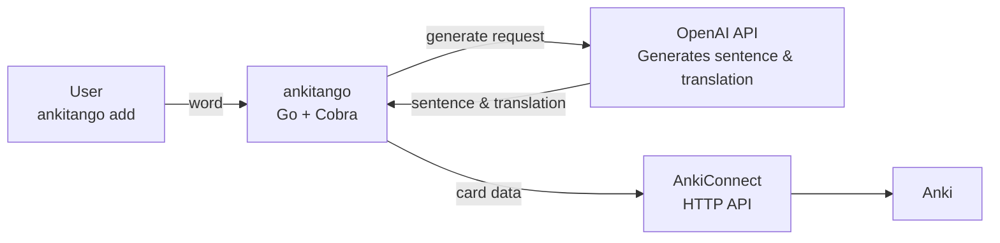
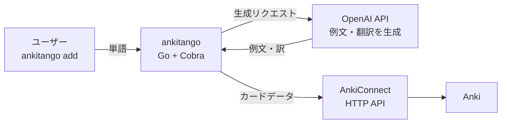

# <!--en-->

## [ankitango](https://github.com/TobiTakuma/ankitango)

A CLI tool that automatically generates translations and example sentences using AI, then adds them to Anki. I created this because manually adding cards to Anki was a hassle.  

## Demo

```bash
ankitango add "choice" "test"

Generating...
{
  "Front": "choice",
  "Front_Sentence": "It's important to make the right choice when it comes to your career.",
  "Back": "選択",
  "Back_Sentence": "キャリアに関して正しい選択をすることが重要です。"
}
Success!
```

## Architecture Diagram

## Tech Stack
- Language: Go
- CLI: cobra (add / list / config commands)
- External Services:
  - OpenAI API - generates translations & example sentences
  - AnkiConnect - adds the generated cards to Anki and lists Anki decks
- Config storage: JSON file (~/.config/ankitango/config.json)
- Distribution: GoReleaser + GitHub Actions

## References
1. [【完全ガイド】Go で CLI ツールを作り、リリースまで一気通貫！](https://zenn.dev/momosuke/articles/how-to-develope-cli-by-go)


## For installation and usage details, see the [README](https://github.com/TobiTakuma/ankitango/blob/main/README.md)

# <!--ja-->

## [ankitango](https://github.com/TobiTakuma/ankitango)

AIで翻訳と例文を自動生成し、そのままAnkiにカードとして追加するCLIツール。手動でAnkiにカードを追加するのが面倒だったので作った。

## デモ

```bash
ankitango add "choice" "test"

Generating...
{
  "Front": "choice",
  "Front_Sentence": "It's important to make the right choice when it comes to your career.",
  "Back": "選択",
  "Back_Sentence": "キャリアに関して正しい選択をすることが重要です。"
}
Success!
```

## アーキテクチャ図

## テックスタック
- 言語: Go
- CLI: cobra（add / list / config コマンド）
- 外部サービス:
  - OpenAI API - 翻訳と例文を生成
  - AnkiConnect - 生成したカードをAnkiに追加・Ankiのデッキ一覧を取得
- 設定の保存先: JSONファイル（~/.config/ankitango/config.json）
- 配布: GoReleaser + GitHub Actions

## 参考
1. [【完全ガイド】Go で CLI ツールを作り、リリースまで一気通貫！](https://zenn.dev/momosuke/articles/how-to-develope-cli-by-go)


## インストール・使い方の詳細は [README](https://github.com/TobiTakuma/ankitango/blob/main/README.md) を参照